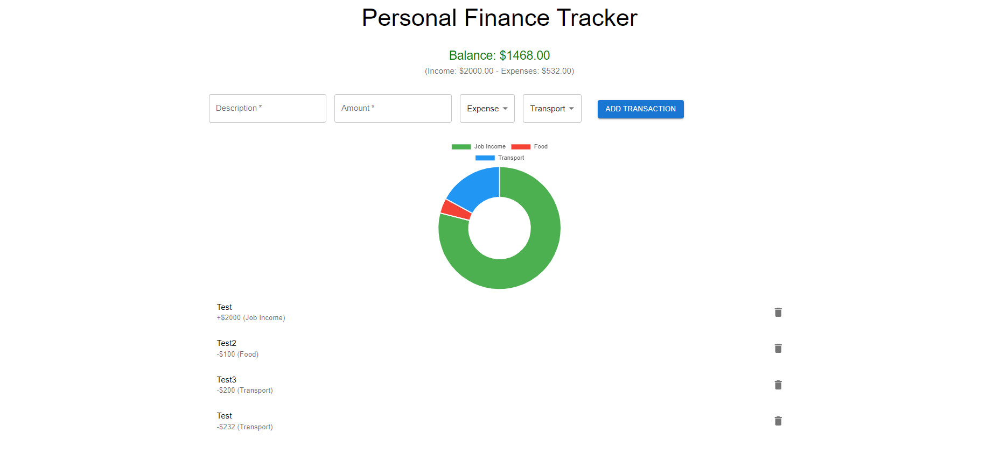

# Personal Finance Tracker

Take control of your finances with this simple, user-friendly web app that helps you track your income and expenses, categorize transactions, and visualize your financial data. Built with the latest tech, this app ensures your data stays local and accessible at all times.



## Why You'll Love It

- **Track Income and Expenses**: Quickly add transactions with descriptions, amounts, and categories.
- **Smart Categorization**: Keep your finances tidy by organizing transactions into categories like "Job Income," "Food," and "Transport."
- **Intuitive Visualizations**: Get clear insights with a beautiful doughnut chart showing where your money is going.
- **Data That Stays Local**: Powered by IndexedDB (via Dexie.js), your data is securely stored right in your browser—no internet required.
- **Comprehensive Balance Overview**: See your total balance, income, and expenses at a glance.

## Built With Tech You Can Trust

- **React**: For a fast and seamless user interface.
- **Redux**: Simplified state management to keep things running smoothly.
- **Material UI**: A polished and responsive UI that looks great on any screen.
- **Chart.js**: Dynamic and beautiful charts to visualize your financial data.
- **Dexie.js**: A powerful wrapper for IndexedDB to keep your data organized and persistent.

### Prerequisites

- Node.js (v16 or higher)
- npm (v7 or higher)

### Installation

1. **Clone the repository:**
   ```bash
   git clone https://github.com/stevenisaacgo03/personal-finance-tracker.git
   cd personal-finance-tracker
   ```

2. **Install dependencies:**
   ```bash
   npm install
   ```

3. **Start the development server:**
   ```bash
   npm start
   ```

4. **Open the app in your browser:**
   Visit [http://localhost:3000](http://localhost:3000).

## How to Use

1. **Add a Transaction:** Click the "Add Transaction" button, fill in the details, and save.
2. **Categorize It:** Select a category from the dropdown to keep your transactions organized.
3. **View Your Data:** Head over to the dashboard to see an overview of your finances and a detailed chart.
4. **Analyze:** Spot trends and adjust your spending with easy-to-read visualizations.

